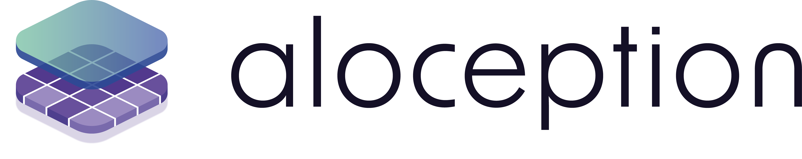

<p align="center">
  
</p>

<a href="https://visual-behavior.github.io/aloception/">Documentation</a>

# Aloception

**Aloception** is a set of packages for computer vision built on top of popular deep learning libraries:
[pytorch](<https://pytorch.org/>)  and  [pytorch lightning](https://www.pytorchlightning.ai/).


### Aloscene

**Aloscene** extend the use of
[tensors](https://pytorch.org/tutorials/beginner/examples_tensor/two_layer_net_tensor.html) with **Augmented Tensors** designed to facilitate the use of computer vision data
(such as frames, 2d boxes, 3d boxes, optical flow, disparity, camera parameters...).


```python
frame = aloscene.Frame("/path/to/image.jpg")
frame = frame.to("cpu")
frame.get_view().render()
```

### Alodataset

**Alodataset** implement ready-to-use datasets for computer vision with the help of **aloscene** and **augmented tensors** to make it easier to transform and display your vision data.

```python
coco_dataset = alodataset.CocoBaseDataset(sample=True)
for frame in coco_dataset.stream_loader():
    frame.get_view().render()
```

### Alonet

**Alonet** integrates several promising computer vision architectures. You can use it for research purposes or to finetune and deploy your model using TensorRT. Alonet is mainly built on top  of [lightning](https://www.pytorchlightning.ai/) with the help of
  **aloscene** and **alodataset**.

**Training**

```python
# Init the training pipeline
detr = alonet.detr.LitDetr()
# Init the data module
coco_loader = alonet.detr.CocoDetection2Detr()
# Run the training using the two components
detr.run_train(data_loader=coco_loader, project="detr", expe_name="test_experiment")
```

**Inference**

```python
# Load model
model = alonet.detr.DetrR50(num_classes=91, weights="detr-r50").eval()

# Open and normalized frame
frame = aloscene.Frame("/path/to/image.jpg").norm_resnet()

# Run inference
pred_boxes = model.inference(model([frame]))

# Add and display the predicted boxes
frame.append_boxes2d(pred_boxes[0], "pred_boxes")
frame.get_view().render()
```


### Note
One can use **aloscene** independently than the two other packages to handle computer vision data, or to improve its
training pipelines with **augmented tensors**.

## Install

Aloception's packages are built on top of multiple libraries. Most of them are listed in the **requirements.txt**
```
pip install -r requirements.txt
```

Once the others packages are installed, you still need to install pytorch based on your hardware and environment
configuration. Please, ref to the `pytorch website <https://pytorch.org/>`_  for this install.

## Getting started

<ul>
  <li><a href="https://visual-behavior.github.io/aloception/getting_started/getting_started.html">Getting started</a></li>
  <li><a href="https://visual-behavior.github.io/aloception/getting_started/aloscene.html">Aloscene: Computer vision with ease</a></li>
  <li><a href="https://visual-behavior.github.io/aloception/getting_started/alodataset.html">Alodataset: Loading your vision datasets</a></li>
  <li><a href="https://visual-behavior.github.io/aloception/getting_started/alonet.html">Alonet: Loading & training your models</a></li>
  <li><a href="https://visual-behavior.github.io/aloception/getting_started/augmented_tensor.html">About augmented tensors</a></li>
</ul>


## Tutorials

<ul>
  <li><a href="https://visual-behavior.github.io/aloception/tutorials/data_setup.html">How to setup your data?</a></li>
  <li><a href="https://visual-behavior.github.io/aloception/tutorials/training_detr.html">Training Detr</a></li>
  <li><a href="https://visual-behavior.github.io/aloception/tutorials/finetuning_detr.html">Finetuning DETR</a></li>
  <li><a href="https://visual-behavior.github.io/aloception/tutorials/training_panoptic.html">Training Panoptic Head</a></li>
  <li><a href="https://visual-behavior.github.io/aloception/tutorials/training_deformable_detr.html">Training Deformable DETR</a></li>
  <li><a href="https://visual-behavior.github.io/aloception/tutorials/finetuning_deformable_detr.html">Finetuning Deformanble DETR</a></li>
  <li><a href="https://visual-behavior.github.io/aloception/tutorials/tensort_inference.html">Exporting DETR / Deformable-DETR to TensorRT</a></li>
</ul>

# Alonet

## Models

| Model name  | Link    | alonet location  | Learn more
|---|---|---|---|
| detr-r50  | https://arxiv.org/abs/2005.12872   | alonet.detr.DetrR50 | <a href="#detr">Detr</a>
| deformable-detr  | https://arxiv.org/abs/2010.04159  | alonet.deformable_detr.DeformableDETR  | <a href="#deformable-detr">Deformable detr</a>
| RAFT | https://arxiv.org/abs/2003.12039 | alonet.raft.RAFT  | <a href="#raft">  RAFT </a> |   |
| detr-r50-panoptic  | https://arxiv.org/abs/2005.12872   | alonet.detr_panoptic.PanopticHead | <a href="#detr-panoptic">DetrPanoptic</a>

## Detr

Here is a simple example to get started with **Detr** and aloception. To learn more about Detr, you can checkout the <a href="#tutorials">Tutorials<a/> or the <a href="./alonet/detr">detr README</a>.

```python
# Load model
model = alonet.detr.DetrR50(num_classes=91, weights="detr-r50").eval()

# Open and normalized frame
frame = aloscene.Frame("/path/to/image.jpg").norm_resnet()

# Run inference
pred_boxes = model.inference(model([frame]))

# Add and display the predicted boxes
frame.append_boxes2d(pred_boxes[0], "pred_boxes")
frame.get_view().render()
```

## Deformable Detr

Here is a simple example to get started with **Deformable Detr** and aloception. To learn more about Deformable, you can checkout the <a href="#tutorials">Tutorials<a/> or the <a href="./alonet/deformable_detr">deformable detr README</a>.

```python
# Loading Deformable model
model = alonet.deformable_detr.DeformableDetrR50(num_classes=91, weights="deformable-detr-r50").eval()

# Open, normalize frame and send frame on the device
frame = aloscene.Frame("/home/thibault/Desktop/yoga.jpg").norm_resnet().to(torch.device("cuda"))

# Run inference
pred_boxes = model.inference(model([frame]))

# Add and display the predicted boxes
frame.append_boxes2d(pred_boxes[0], "pred_boxes")
frame.get_view().render()
```

## RAFT

Here is a simple example to get started with **RAFT** and aloception. To learn more about RAFT, you can checkout the <a href="./alonet/raft">raft README</a>.

```python
# Use the left frame from the  Sintel Flow dataset and normalize the frame for the RAFT Model
frame = alodataset.SintelFlowDataset(sample=True).getitem(0)["left"].norm_minmax_sym()

# Load the model using the sintel weights
raft = alonet.raft.RAFT(weights="raft-sintel")

# Compute optical flow
padder = alonet.raft.utils.Padder()
flow = raft.inference(raft(padder.pad(frame[0:1]), padder.pad(frame[1:2])))

# Render the flow along with the first frame
flow[0].get_view().render()
```

## Detr Panoptic

Here is a simple example to get started with **PanopticHead** and aloception. To learn more about PanopticHead, you can checkout the <a href="./alonet/detr_panoptic">panoptic README</a>.

```python
# Open and normalized frame
frame = aloscene.Frame("/path/to/image.jpg").norm_resnet()

# Load the model using pre-trained weights
detr_model = alonet.detr.DetrR50(num_classes=250, background_class=250)
model = alonet.detr_panoptic.PanopticHead(DETR_module=detr_model, weights="detr-r50-panoptic")

# Run inference
pred_boxes, pred_masks = model.inference(model([frame]))

# Add and display the boxes/masks predicted
frame.append_boxes2d(pred_boxes[0], "pred_boxes")
frame.append_segmentation(pred_masks[0], "pred_masks")
frame.get_view().render()
```

# Alodataset

Here is a list of all the datasets you can use on Aloception. If you're dataset is not in the list but is important for computer vision. Please let us know using the issues or feel free to contribute.


## Datasets

| Dataset name  | alodataset location  | To try
|---|---|---|
| CocoDetection  | alodataset.CocoBaseDataset   | `python alodataset/coco_base_dataset.py`
| CocoPanoptic  | alodataset.CocoPanopticDataset   | `python alodataset/coco_panopic_dataset.py`
| CrowdHuman  | alodataset.CrowdHumanDataset   | `python alodataset/crowd_human_dataset.py `
| Waymo  | alodataset.WaymoDataset   | `python alodataset/waymo_dataset.py`
| ChairsSDHom | alodataset.ChairsSDHomDataset | `python alodataset/chairssdhom_dataset.py`
| FlyingThings3DSubset | alodataset.FlyingThings3DSubsetDataset | `python alodataset/flyingthings3D_subset_dataset.py`
| FlyingChairs2 | alodataset.FlyingChairs2Dataset | `python alodataset/flying_chairs2_dataset.py`
| SintelDisparityDataset | alodataset.SintelDisparityDataset | `python alodataset/sintel_disparity_dataset.py`
| SintelFlowDataset | alodataset.SintelFlowDataset | `python alodataset/sintel_flow_dataset.py`
| MOT17 | alodataset.Mot17 | `python alodataset/mot17.py`


# Unit tests

```
python -m pytest
```

# Licence

Shield: [![CC BY-NC-SA 4.0][cc-by-nc-sa-shield]][cc-by-nc-sa]

This work is licensed under a
[Creative Commons Attribution-NonCommercial-ShareAlike 4.0 International License][cc-by-nc-sa].

[![CC BY-NC-SA 4.0][cc-by-nc-sa-image]][cc-by-nc-sa]

[cc-by-nc-sa]: http://creativecommons.org/licenses/by-nc-sa/4.0/
[cc-by-nc-sa-image]: https://licensebuttons.net/l/by-nc-sa/4.0/88x31.png
[cc-by-nc-sa-shield]: https://img.shields.io/badge/License-CC%20BY--NC--SA%204.0-lightgrey.svg
