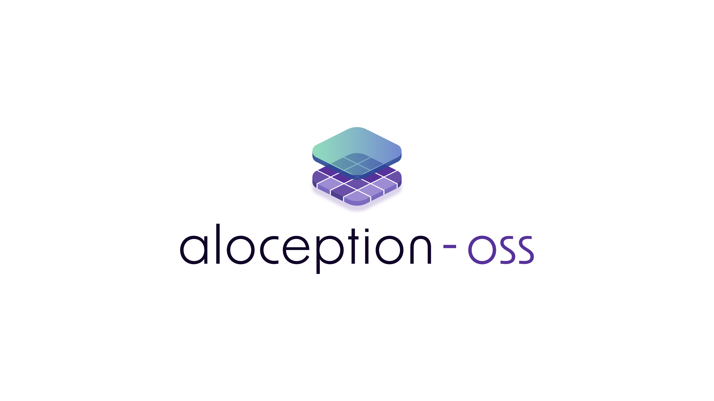

<p align="center">
  
</p>

<a href="https://visual-behavior.github.io/aloception-oss/">Documentation</a>

[](https://conventionalcommits.org)

# Aloception open source software

**Aloception-oss** is a set of packages for computer vision built on top of popular deep learning library:
[pytorch](<https://pytorch.org/>).


### Aloscene

**Aloscene** extend the use of
[tensors](https://pytorch.org/tutorials/beginner/examples_tensor/two_layer_net_tensor.html) with **Augmented Tensors** designed to facilitate the use of computer vision data
(such as frames, 2d boxes, 3d boxes, optical flow, disparity, camera parameters...).


```python
frame = aloscene.Frame("/path/to/image.jpg")
frame = frame.to("cpu")
frame.get_view().render()
```

### Alodataset

**Alodataset** implements ready-to-use datasets for computer vision with the help of **aloscene** and **augmented tensors** to make it easier to transform and display your vision data.

```python
coco_dataset = alodataset.CocoBaseDataset(sample=True)
for frame in coco_dataset.stream_loader():
    frame.get_view().render()
```

### Alonet

**Alonet** offers a suite of tools designed to facilitate the creation of efficient training pipelines and model deployment using TensorRT. Built primarily with [pytorch](<https://pytorch.org/>), **alonet** provides extensive flexibility to extend and customize training pipelines and models. It works seamlessly with **aloscene** and **alodataset** to enhance its capabilities.

For a standard training pipeling utilizing **alonet**, **alodataset** and **aloscene**, you can explore the [DETR model](./alonet/models/detr/).

### Note
One can use **aloscene** independently than the two other packages to handle computer vision data, or to improve its
training pipelines with **augmented tensors**.

## Installation

### Docker install

- The default docker image is based on **Ubuntu 20.04**, **cuda 12.6.3**, **python 3.10** and **pytorch 2.7**.
```bash
docker build -t aloception-oss:cuda-12.6-pytorch-2.7 .
```

- For building your own version
```bash
docker build -t TAG --build-arg BASE_IMAGE=base_image --build-arg PYTHON_VERSION=python_version --build-arg PYTORCH_VERSION=pytorch_version --build-arg TORCHVISION_VERSION=torchvision_version --build-arg TORCHAUDIO_VERSION=torchaudio_version
```
`base_image` can be found at [Nvidia cuda's Dockerhub](https://hub.docker.com/r/nvidia/cuda/tags).


- Launch docker container
```
docker run  -e LOCAL_USER_ID=$(id -u)  --gpus all -it -v /YOUR/WORKSPACE/:/home/aloception --privileged -e DISPLAY=$DISPLAY -v /tmp/.X11-unix:/tmp/.X11-unix aloception-oss:cuda-12.6-pytorch-2.7
```


### Pip install

You first need to install PyTorch based on your hardware and environment
configuration. Please refer to the [pytorch website](https://pytorch.org/get-started/locally/) for this installation.

Once this is done, you can run:
```sh
pip install git+https://github.com/Visual-Behavior/aloception-oss/
```

<br/>

Alternatively, you can clone the repository and use:
```sh
pip install -e aloception-oss/
```

Or setup the repo yourself in your env and install the dependencies

```sh
pip install -r requirements.txt
```


## Getting started

<ul>
  <li><a href="https://visual-behavior.github.io/aloception-oss/getting_started/getting_started.html">Getting started</a></li>
  <li><a href="https://visual-behavior.github.io/aloception-oss/getting_started/aloscene.html">Aloscene: Computer vision with ease</a></li>
  <li><a href="https://visual-behavior.github.io/aloception-oss/getting_started/alodataset.html">Alodataset: Loading your vision datasets</a></li>
  <li><a href="https://visual-behavior.github.io/aloception-oss/getting_started/alonet.html">Alonet: Loading & training your models</a></li>
  <li><a href="https://visual-behavior.github.io/aloception-oss/getting_started/augmented_tensor.html">About augmented tensors</a></li>
</ul>


## Tutorials

<ul>
  <li><a href="https://visual-behavior.github.io/aloception-oss/tutorials/data_setup.html">How to setup your data?</a></li>
  <li><a href="https://visual-behavior.github.io/aloception-oss/tutorials/training_detr.html">Training Detr</a></li>
  <li><a href="https://visual-behavior.github.io/aloception-oss/tutorials/finetuning_detr.html">Finetuning DETR</a></li>
  <li><a href="https://visual-behavior.github.io/aloception-oss/tutorials/training_panoptic.html">Training Panoptic Head</a></li>
  <li><a href="https://visual-behavior.github.io/aloception-oss/tutorials/training_deformable_detr.html">Training Deformable DETR</a></li>
  <li><a href="https://visual-behavior.github.io/aloception-oss/tutorials/finetuning_deformable_detr.html">Finetuning Deformanble DETR</a></li>
  <li><a href="https://visual-behavior.github.io/aloception-oss/tutorials/tensort_inference.html">Exporting DETR / Deformable-DETR to TensorRT</a></li>
</ul>

# Alonet

## Pipeline
A pipeline in **alonet** is composed of 3 key components:
- **Model**: Define model architecture.
- **Trainer**: Manages the training loop.
- **Data module**: Configures the  data loaders for training/validation/test.

Each component's parameters can be configured by **Config**, which can be specified via command line arguments when launching the training or through a configuration YAML file.

For a concrete example, refer to [DETR training script](./alonet/models/detr/scripts/train_detr50_on_coco.py).

For launching distributed training (multi-node or multi-worker), refer to [torchrun documentation](https://docs.pytorch.org/docs/stable/elastic/run.html).


### Model
The model is implemented by subclassing `torch.nn.Module` as usual.
```python
class Detr(nn.Module):
    def __init__(
        self,
        backbone,
        transformer,
    ):
      ...

    def forward(x: torch.Tensor):
      ...
```

### Trainer
The [BaseTrainer](./alonet/common/base_trainer.py) can be subclassed to create custom training loops. It provides several utility functions to setup the directory for saving checkpoint and logs, format the name of checkpoints, save necessary state dict and to resume training sessions.

Unlike [pytorch-lightning](https://lightning.ai/docs/pytorch/stable/), **BaseTrainer** does not include a pre-implemented training loop. This means you need to implement the training loop yourself (forward, backward, optimizer step, logging, validation, ect ...) using the provided utility functions. While this approach may slow down development, it offers greater flexibility and control over your training pipeline.

In your subclass, you need to implement the following methods:
- `build_criterion`: Initialize loss function
- `build_optimizer`: Initialize optimizer
- `build_lr_scheduler`: Initialize learning rate scheduler (if you need)
- `training_step`: Implement single training step
- `train`: Implement the training loop with pytorch
- `validation_step`: Single validtion step
- `validate`: Implement the validation loop during training.

For a complete example of **Trainer**, please look at [DERT's trainer](./alonet/models/detr/trainer.py).

### Data module
Data module serves as a container of data loaders used for training, validation, testing.

The [BaseDatamodule](./alonet/common/base_datamodule.py) can be subclassed.
You need to implement `setup_train_dataloader` and `setup_val_dataloader` to create dataloaders used for training and validation. `setup_test_dataloader` can also be implemented if needed.

Below is a simple example of how to set up data loaders.
```python
# Initialize data module
data_module = CocoDetection2Detr(**training_config.data_module.to_dict())
data_module.setup("training")
```

### Configuration
[BaseConfig](./alonet/common/base_config.py) provides a flexible approach to configuring the training pipeline. All the parameters required to initialize **Model**/**Data Module**/**Trainer** objects are defined within **Configuration** (checkout [BaseTrainerConfig](./alonet/common/base_config.py) and [BaseDataModuleConfig](./alonet/common/base_config.py) for examples). These parameters can be specified when launching the training either via command line argument or by a YAML file.

**BaseConfig** is extendable through subclassing and nesting, enabling complex configurations. More examples can be found at [DETR config](./alonet/models/detr/config).

Each training configuration is saved as an artifact in the training directory.


## Models

| Model name  | Link    | alonet location  | Learn more
|---|---|---|---|
| detr-r50  | https://arxiv.org/abs/2005.12872   | alonet.models.detr.models.DetrR50 | <a href="#detr">Detr</a>
| deformable-detr  | https://arxiv.org/abs/2010.04159  | alonet.models (training pipeline not supported in this version)  | <a href="#deformable-detr">Deformable detr</a>
| RAFT | https://arxiv.org/abs/2003.12039 | alonet.models (training pipeline not supported in this version)  | <a href="#raft">  RAFT </a> |   |
| detr-r50-panoptic  | https://arxiv.org/abs/2005.12872   | alonet.models (training pipeline not supported in this version) | <a href="#detr-panoptic">DetrPanoptic</a>

## Detr

Here is a simple example to get started with **Detr** and aloception. To learn more about Detr, you can checkout the <a href="#tutorials">Tutorials<a/> or the <a href="./alonet/detr">detr README</a>.

```python
# Load model
model = alonet.detr.DetrR50(num_classes=91, weights="detr-r50").eval()

# Open and normalized frame
frame = aloscene.Frame("/path/to/image.jpg").norm_resnet()

# Run inference
pred_boxes = model.inference(model([frame]))

# Add and display the predicted boxes
frame.append_boxes2d(pred_boxes[0], "pred_boxes")
frame.get_view().render()
```


# Alodataset

Here is a list of all the datasets you can use on Aloception. If you're dataset is not in the list but is important for computer vision. Please let us know using the issues or feel free to contribute.


## Datasets

| Dataset name  | alodataset location  | To try
|---|---|---|
| CocoDetection  | alodataset.CocoBaseDataset   | `python alodataset/coco_base_dataset.py`
| CocoPanoptic  | alodataset.CocoPanopticDataset   | `python alodataset/coco_panopic_dataset.py`
| CrowdHuman  | alodataset.CrowdHumanDataset   | `python alodataset/crowd_human_dataset.py `
| Waymo  | alodataset.WaymoDataset   | `python alodataset/waymo_dataset.py`
| ChairsSDHom | alodataset.ChairsSDHomDataset | `python alodataset/chairssdhom_dataset.py`
| FlyingThings3DSubset | alodataset.FlyingThings3DSubsetDataset | `python alodataset/flyingthings3D_subset_dataset.py`
| FlyingChairs2 | alodataset.FlyingChairs2Dataset | `python alodataset/flying_chairs2_dataset.py`
| SintelDisparityDataset | alodataset.SintelDisparityDataset | `python alodataset/sintel_disparity_dataset.py`
| SintelFlowDataset | alodataset.SintelFlowDataset | `python alodataset/sintel_flow_dataset.py`
| MOT17 | alodataset.Mot17 | `python alodataset/mot17.py`


# Unit tests

```
python -m pytest
```

# Licence

Shield: [![CC BY-NC-SA 4.0][cc-by-nc-sa-shield]][cc-by-nc-sa]

This work is licensed under a
[Creative Commons Attribution-NonCommercial-ShareAlike 4.0 International License][cc-by-nc-sa].

[![CC BY-NC-SA 4.0][cc-by-nc-sa-image]][cc-by-nc-sa]

[cc-by-nc-sa]: http://creativecommons.org/licenses/by-nc-sa/4.0/
[cc-by-nc-sa-image]: https://licensebuttons.net/l/by-nc-sa/4.0/88x31.png
[cc-by-nc-sa-shield]: https://img.shields.io/badge/License-CC%20BY--NC--SA%204.0-lightgrey.svg
