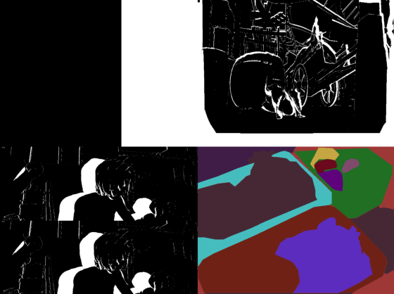

Mask
----

The :mod:`Mask <aloscene.mask>` object represents a binary or float mask. It can be used to represent different
objects, for example occlusions mask for flow and disparity use cases, or binary masks per object for segmentation
tasks.

  Mask types representation in different scenarios: **(top-left)** a binary mask used by :mod:`Frame <aloscene.frame>`
  in :func:`resize` and :func:`forward` process, **(top-right)** a float mask used to flow representation,
  **(bottom-left)** a float mask used to render the disparity view and **(bottom-right)** multiple binary masks which
  encode the presence of an object in each pixel.

.. note::

   The values of a :mod:`Mask <aloscene.mask>` are between 0. and 1., to allow to partially/completely mask another
   tensor by multiplying it by the mask.

Basic Use
=========

A :attr:`Mask` object can be initialized from a path to a mask file::

   from aloscene import Mask
   mask = Mask("path/to/mask.png")

or from an existing tensor::

   import torch
   mask_float_tensor = torch.rand((1,400,600))
   mask = Mask(mask_tensor, names=("N","H","W"))

when a label is assigned to each mask, a segmentation view (one mask per object) is carried out::

   from aloscene import Labels

   # Four corner objects will be created
   labels = Labels(torch.as_tensor([0,1,1,0]), names = ("N"), labels_names = ["thing", "stuff"])
   mask_for_segmentation = Mask(torch.zeros(4,400,600), names=("N","H","W"))
   for i, (x, y) in enumerate(zip([0, 300, 0, 300], [0, 0, 200, 200])):
      mask_for_segmentation[i, y : y + 200, x : x + 300] = 1

   # Render with panoptic view
   mask_for_segmentation.append_labels(labels)
   mask_for_segmentation.get_view().render()

Mask API
========

.. automodule:: aloscene.mask
   :members:
   :undoc-members:
   :show-inheritance:
